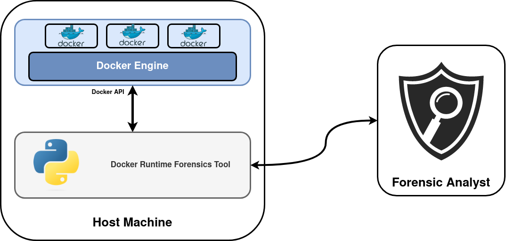
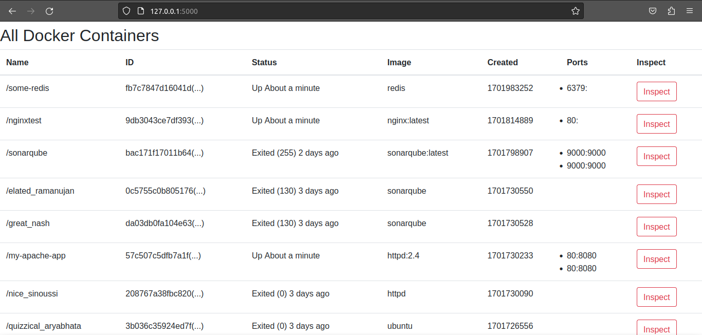
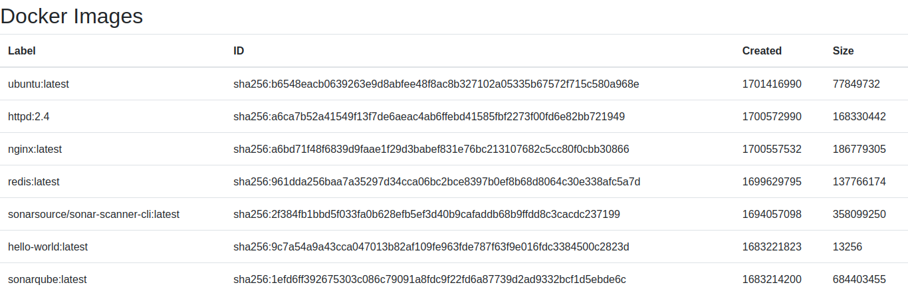
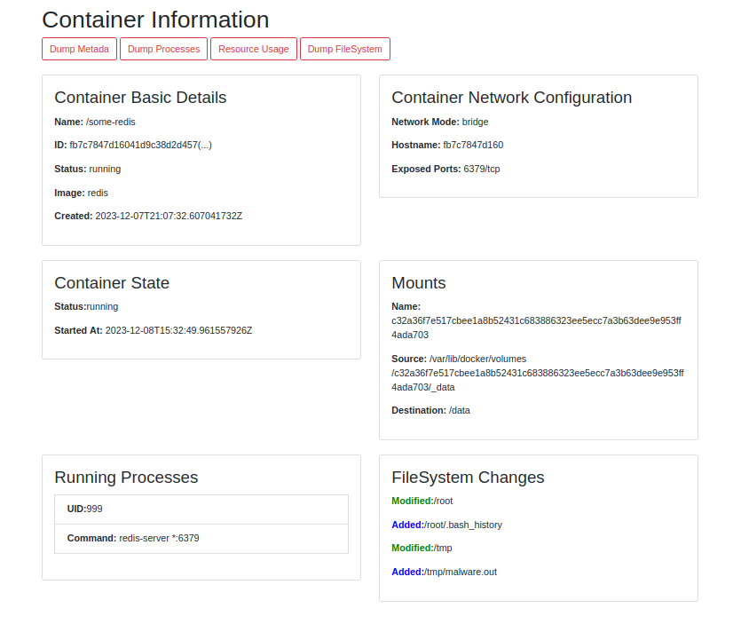

# Docker Forensics - Tools and Techniques

## Docker Forensics Runtime Tool

### Run

```
./main.py
```


### State of the Art

In the current landscape of Docker forensics tools, there are several advancements in both static analysis and post-mortem investigation. Tools such as Clair, DockerScan, and Anchore are employed for static analysis of container images, enabling the detection of potential vulnerabilities and security risks. Meanwhile, Docker-Forensics-Toolkit stands out as a comprehensive tool specialized in post-mortem analysis specifically tailored for Docker environments.

Monitoring systems like Prometheus and Grafana \cite{Prometheus_2023} utilize the Docker API as a foundation, serving as powerful tools for monitoring and time series databases. However, while Prometheus excels in monitoring capabilities, it lacks specific features tailored for forensic analysis. \cite{9064441}

To address this gap, the started the development of a Docker API-based tool tailored specifically for forensic purposes. This tool aims to enhance the forensic investigation capabilities within Docker environments.

### Goal
The need for a Runtime Docker Forensics Tool (RDFT) is paramount due to several critical challenges inherent in containerized environments, as described previously. Containers' transient nature allows easy creation, destruction, and recreation, often resulting in the loss of critical evidence before investigations can begin. Docker's dynamic networking and IP addressing further complicate investigations by making it arduous to track and analyze network communications. The usage of docker in Cloud-based distributed environments poses a challenge, demanding tools adept at accessing distributed logs and correlating events across multiple host machines with varying operating systems.

The development of a Remote Runtime Docker Forensics Tool, designed to remotely capture volatile data within a Docker environment, holds significant utility in the following aspects:


* Extraction of real-time runtime data for in-depth analysis.
* Facilitating the collection of forensic evidence is crucial for conducting comprehensive security investigations.

### Architecture and Components

The Docker Runtime Forensics Tool operates within the host machine of containers. Developed using Flask, a Python-based micro web framework, this tool interacts with the Docker Engine through the Docker API. By leveraging this API, the tool accesses data efficiently through a well-defined data pipe, minimizing system strain.

To utilize this service, specific ports must be opened within the Docker environment. This facilitates access to the tool and forensic data by a forensics analyst over TCP/IP through straightforward HTTP requests via a web browser. This approach enhances security compared to directly exposing the Docker API and facilitates gathering forensic data from Docker Environments. 




### Use Cases

1. **Container Enumeration**
    Identify and list all Docker containers present on the host machine. List the unique ID, name, status, date of creation (in Unix time), and network ports.
    

    

2. **Image Inventory**
    List and document all Docker images stored on the system. List names/labels, the sha256 of the image or image ID, the date of creation (in Unix time), size of the image in bytes.

    

3. **Visual Representation**
    Provide visual representations detailing relevant metadata, ongoing processes, and changes made to files within Docker containers comparing to the base image, and network information.

    


4. **Metadata Extraction**
    Extract detailed metadata about a specific Docker container in JSON format, including its ID, associated image ID, creation command, configured ports, network settings, mounted volumes, and other pertinent information.
    
5. **Process Retrieval**
    Retrieve and document all active processes running within a targeted Docker container in JSON format.

6. **Resource Utilization Snapshot**
    Gather and retrieve real-time resource utilization metrics for a Docker container, such as I/O statistics, CPU count, CPU usage percentage, available memory, memory statistics, and network statistics per network interface in JSON format. 

7. **File System Dump**
    Retrieve the entire file system within a Docker container in tar format
    

