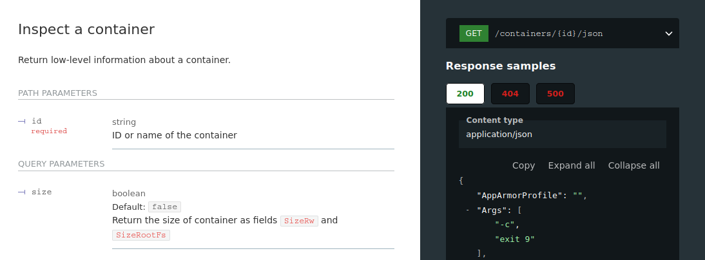
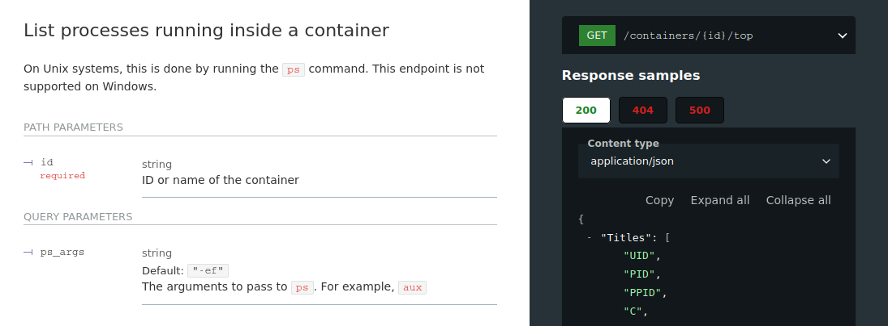
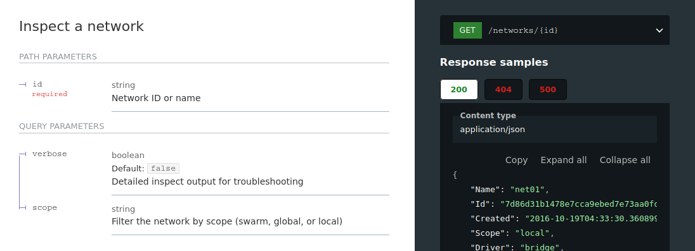
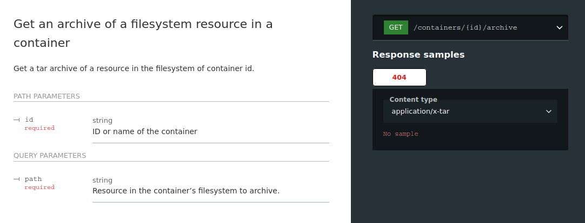
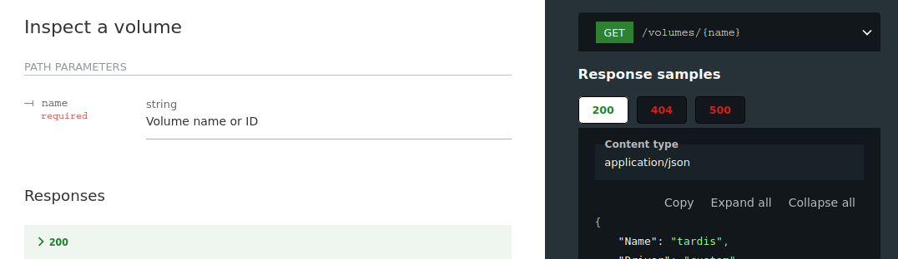
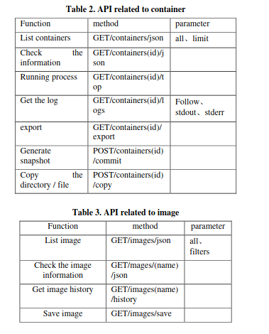
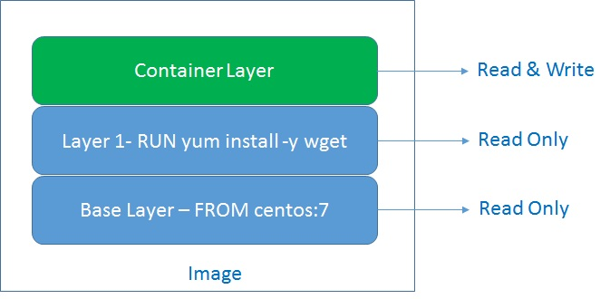
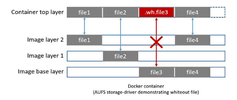

# Notes from the different pappers

## Docker API

https://docs.docker.com/engine/api/v1.43/#tag/Container/operation/ContainerTop









Dumping process memory from docker container:
* https://stackoverflow.com/questions/75475032/dump-docker-container-memory
* https://www.reddit.com/r/docker/comments/rcgzru/get_docker_container_memory_dump_for_analysis/


## Docker File System Layers 

For more info there is this video:

<iframe src="https://www.youtube.com/watch?v=Bc0iWolzaz4"></iframe>



An image has many layers. When a container starts, only one read-write layer is attached on top of all the layers of images.

All the changes a container makes are made to the editable R/W layer and not to the underlying image layers. Therefore, a number of containers can use the same image with each having its own R/W layer.

Copy-on-Write (CoW) mechanism in its storage drivers. This mechanism satisfies the need of different containers to share the same image. However, when a single container performs operations such as modification of an image file, a duplicate image is created in the upper read-write layer.
Advantages of using Docker Layers

* Good storage management
* Faster builds
* Faster deployments
* Sharing across multiple containers
* Enhanced scalability

### Conclusion:

Docker Layers and Cache are important concepts when it comes to adopting good practices of creating any Docker infrastructure. Small tweaks here and there can increase the efficiency of scalability and deployments.

I have tried to explain the concepts in a simple and easy to understand language here to make readers interested into using these in their docker practices.

## Insight from a Docker Container Introspection 

```
introspection tools, which are able to acquire data
from a system as it is running, can be utilized as both
an early warning system to protect that system and as
a data capture system that collects data that would be
valuable from a digital forensic perspective.
```

```
the data about containers must be accessed/collected
while they are executing. In order to access this data,
application programming interfaces (APIs) have been
created and leveraged to create introspection tools
[22, 23]. These introspection tools have the ability to
obtain data from a running container environment
regardless of running time.

[22] Prometheus - Monitoring system & time series
database. 2018.
[23] Datadog, Infrastructure & Application Monitoring as
a Service | Datadog. 2015
```

```
he research contribution of this paper is an
initial analysis of the viability of introspection tools
for performing a security analysis of containerized
software. 
```

```
Whereas previous approaches dealt with
hypervisors and/or underlying systems in cloud
infrastructure, Casalicchio and Percibali [38] focused
specifically on containers. In particular, they sought
to determine if tools collected the same information.
The researchers tested a battery of traditional Linux
metrics including iostat and mpstat as well as
utilizing the container specific cAdvisor [39] and the
platform specific docker stats command to pipe
metrics into both Prometheus [22] and Grafana [40]
for collection. Tests centered upon CPU and Disk I/O
intensive workloads. They determined different tools
present similar but not completely equal results.
```

```
he previous studies concentrated on gathering
behavior and performance evidence of various types;
however, the scalability of the approaches was not
directly assessed. Stelly et al. [44] dealt with this
issue via the containerization of the digital forensics
process with their SCARF toolkit. They focused on
scalability across large platforms using Docker
Swarm, and attempted to prove that while the data
needed for forensic analysis continue to expand as
cloud adoption increased, their platform could extend
just as easily by showing high throughput. The group
ran tests on both a legacy cluster, and a cluster with
cutting edge hardware and found that several of the
components of the SCARF system, such as Yahoo’s
OpenNSFW network [45], had large throughput gains
comparing the two systems.
```

### Experiment

```
Prometheus is an open source introspection tool
that provides the ability to check multiple nodes in a
containerized architecture

Prometheus utilizes the
Docker API, which allows Prometheus to access data
via a well-defined data pipe; this also mitigates the
amount of stress on the system. In order to use the
service, ports have to be opened within the Docker
environment, as well as configured within
Prometheus to listen and scrape information from the
Docker environment
```

**Docker API** - in the papper they talk about how Prometheus uses the docker API. This API may be used to do forensics on containers during runtime. https://docs.docker.com/engine/api/v1.43/#tag/Container/operation/ContainerTop


## Forensic Analysis of Docker Swarm Cluster using Grr Rapid Response Framework


```
Currently, Docker is one of the container ma-
chines implemented by almost 25% of the world’s Internet
companies [1,2]. Fig. 1 shows a significant rate of Docker
utilization in Internet companies until the beginning of 2018.

[1] D. Liu and L. Zhao, “The research and implementation of cloud com-
puting platform based on docker,” in Wavelet Active Media Technology
and Information Processing (ICCWAMTIP), 2014 11th International
Computer Conference on. IEEE, 2014, pp. 475–478.
[2] Datadog, “8 surprising facts about real docker adoption,”
https://www.datadoghq.com/docker-adoption/, 2018.
```

It's mostly about network analysis, and Grr Rapid Response Framework, not very usefull for this work.

## A Method of Docker Container Forensics Based on API

```
The paper explains Docker service principles and structural
features, and analyzing the model and method of forensics in
related cloud environment, then proposes a Docker container
forensics solution based on the Docker API. In this paper, Docker
APIs realize the derivation of the Docker container instances,
copying and back-up of the container data volume, extraction of
the key evidence data, such as container log information,
configuration information and image information, thus conducts
localized fixed forensics to volatile evidence and data in the
Docker service container. Combined with digital signatures and
digital encryption technology to achieve the integrity of the
original evidence data protection.
```


### At this stage, Docker container forensics mainly faces the following problems:

```
1) Evidence Volatility: The Docker container application service
is deployed on the cloud server. After the container is deleted, the
data in the container will also be deleted. And its virtualization
resources will be recycled, resulting in the complete loss of data
within the container, that is, the volatile data in the Docker
application service online will be lost and can’t be retrieved.
```
```
2) Evidence Integrity: The integrity of evidence needs to be
maintained during the current cloud forensic investigation, but this
is very difficult. Data integrity is a difficult part of the cloud
forensics process, the original data can’t be modified.
Additionally, Docker container forensics must be able to source
raw data from a running container based on the CSP without
affecting the service provided by the CSP, and because the host
that provides Docker application services may come from
different CSP, it is necessary to implement the authentication and
authorization of the forensics and the CSP
```
```
3) Cross-platform, cross-host container forensics. As a lightweight
virtualization technology, Docker is widely used to build PaaS
platform. But unlike IaaS, PaaS can run on multiple independent
hosts, even if the hosts come from different service providers.
This requires that container forensics not only take data from a
host's container, but also manage the forensics process on multiple
hosts.
```

### API-based Docker Container Forensics Program

This is very similar to what we wanna do.

**Analysis of the Docker Directory**

```
1) The graph directory to store all the image's description file. For
each image layer, the graph directory has two files json and
layersize, and json file records the corresponding Docker image
ID, dependencies, create time and configuration information, etc.,
layersize records the size of the Docker image, and the complete
data of the image itself is stored in the/var/lib/docker/aufs/diff
directory.
```
```
2) Containers stored in the container directory configuration
information, the configuration information contains all the
metadata of a container. As table 1 shows below:
```
Container configuration file and content

file name | file content
|---|---|
|\[container-id]-json.log | container log information|
|hostconfig.json | define the distribution of each resource
container|
| hostname | define the host name inside the container| 
| hosts | define the container's routing table |
| resolv.config | define the container's DNS server address|
| resolv.config.hash |the hash value of the resolv.config file|
```
3) The Docker data volume is a mechanism introduced for the
sharing and persistence of files and folders between containers
and hosts, between containers and containers. When creating a
volume from a folder in a container, the volume's ID directory is
included in the/var/lib/docker/volume path, which means any
changes in the container's mounted folder are reflected directly in
the host/var/lib/docker/[container-ID]/_data path, at the same time
this reflection is bidirectional.
```

**Docker API**


```
Using the related APIs, we can Program using docker-py
libraries from Docker's official portals for listing containers,
viewing information, running processes, getting logs, exporting
containers, generating container snapshots, copying directories /
files from containers, Such as container data, container log
information, container configuration information, and container
mounting data volume, etc. The system can obtain the information
of the object of the forensic object, such as container data,
container log information, container configuration information,
container mounted data volume, and the like
```

## INCIDENT ANALYSIS AND FORENSICS IN DOCKER ENVIRONMENTS

```
Previous forensic methods focus predominantly on physical or virtual machines, which do not
fundamentally differ in the actual analysis steps. However, it has not yet been considered how traditional
processes must be changed to assimilate the use of Docker containers. This article tries to contribute to
close this gap
```

As explained before, the read and write layer refered in the paper is the active filesystem inside the active container. An explanation and diagram can be found in the beginning of the papper.

### Difference from normal enviorments

Basicaly, just dumping the File System of the host and analyzing will not give us the full picture of the files inside the container

```
In principle, a forensic analysis gets started on a Docker host just like on a regular system: A dump of the
hard disk and ideally the main memory is created. However, the analysis of the dumps may provide
incomplete results, unless the specifics of (Docker) containers are taken into account. A typical analysis of
disk and memory dumps would still result in a list of files and processes, but the mapping to containers, or
even information about whether certain files are relevant for the reconstruction of the actual file system
view of the live system would not be included. The following sections represent various aspects to
consider, when analyzing Docker hosts to provide a comprehensive forensic analysis.
```

```
For example, searching for files on a disk dump of the host system will also find files from Docker Images.
However, the following additional questions must be answered on a Docker host:
1) Which image provided the given file?
2) Which containers used the given file?
3) Was the file deleted at container level? (This operation is potentially different from deletions on
regular file systems)
To answer these questions, it is relevant that an image can be used by several containers by using the r/w
layer. An association between files and containers is (only) possible via runtime information and, if
available, specific configuration files. 
```

```
If a runtime analysis is not possible, various
configuration files contain information about containers on the system. The default directory for Docker’s
configuration is /var/lib/docker. Container configuration is stored in
/var/lib/docker/container/ContainerID. Containers that are currently being executed can be
identified by two characteristics: On the one hand, the container configuration config.v2.json contains
the attribute Running: true and on the other hand, the Linux file system permissions of the container
subdirectory shm are set to 1777. There is also a dedicated directory for the r/w layer that indicates
whether a container has been started in the past (see Section 4.2.2)

Furthermore, it must be identified whether the file originates from a container (i.e. the r/w layer) or an
image. This information is relevant for analyzing the visibility of the file at runtime. If a file is deleted within
a container, there are two possibilities for the deletion:
1) The file originates from the r/w layer: In this case the file is deleted with normal operating system
mechanisms on the underlying file system layer.
2) The file originates from an image layer: In this case, a deletion reference is left in the r/w layer, but
the file remains present in the image layer.
Accordingly, different methods must be used to recover deleted files, which we explain in the following
sections
```

### Recovering files

Not specific to docker but files sometimes may be recoverable if the memory is analyzed. Out of the scope of the project but also possible. 

```
If a file which was stored in the r/w layer of the container is deleted, this file (reminder: which is stored as
a regular file in the host file system) is deleted in the file system of the host. Which metadata is retained in
the file system and how it can be recovered depends on the actual host file system (such as ext3, ext4, zfs,
...). It would be beyond the scope of this article to address the specificities, but these are not specific to
Docker, but common forensic file system analysis conditions and are well known and well documented
(Carrier, File System Forensic Analysis, 2005).

methods for recovering a deleted file from the r/w layer correspond to those
used in the forensic analysis of a physical disk or virtual disk
```

It differs a bit thought because the machine may not be analyzed from within itself

```
It should be noted that with a classic virtual machine, it is also possible to directly
analyze the hard disk device (such as /dev/sda) from within the virtual machine with forensic software. This option does not exist in Docker containers (even with root privileges)
because the device can not be opened
```

```
Basically, there are two common file recovery methods available:
1) File Carving
2) Filesystem Analysis
```


**File Carving**

Out of the scope of this project but it's kinda interesting and may be talked about in the report nontheless

```
typically used to describe the method of linearly
searching a volume, disk image, or file for characteristic patterns (magic bytes) for the beginning and/or
end of files. Since the file system is not considered, this approach can recover both allocated and deleted
files that have not yet been overwritten. However, fragmented files (with a few exceptions from specialized
carvers for certain single file types) can only be reconstructed incompletely. Furthermore, any meta-
information about the files, such as their filename, path, timestamp, or similar is missing.


the usage for forensic investigations in the Docker environment is subject to
problems: Assigning a previously deleted file recovered by file carving to a specific container, or even just
distinguishing whether the file belonged to a Docker container or the host system itself, is only possible
with metadata. However, as discussed above, files that have been restored by carving usually lack such
information, so that a reliable assignment is no longer possible. Only if the content of the file itself
provides information about its context (for example, if it contains a ContainerID), an association can be
made.
```

**file system analysis**

```
In contrast to file carving, the file system analysis uses management structures stored in the file system,
such as the MFT (master file table) in the case of NTFS or the inode tables of the group descriptors in the
case of ext file systems. Depending on the file system and circumstance, deleted files can also be
recovered based on this information, as described in detail by Brian Carrier (Carrier, The sleuth kit, 2007)
```

**Recovery of Files of an Image Layer**

```
In this case, a deletion reference is stored in the r/w layer as shown in Figure 3, but the file remains in the image layer.
Overlay2 allocates an inode in the r/w layer, which bears the name of the deleted file and is marked as a
character device by a file system flag. Thus, all files deleted in a lower layer can be identified by the
following command: find /var/lib/Docker/overlay2/$ContainerID/diff -type c. File recovery is
then possible by means of iterating through the layers and checking whether the corresponding file is
existent.
We would like to note that the procedure described here works analogously in the post-mortem analysis of
the entire host system. Equally, corresponding inodes can be identified and, if appropriate, the associated
files can be extracted from the directory of the underlying layer containing the original file
```




### Processes

```
The PIDs on the host are always unique, only the PID within the container can
be displayed identically to a PID on the host. This fact becomes relevant when log files contain PIDs and
should be used for post-mortem analysis. A translation from container PID to host PID is not possible
without runtime information.

Similarly to PID namespaces, user namespaces allow to map a user ID (UID) or group ID (GID) from one
container to another UID on the host. For example, a process can run inside a container with UID 0, but the
corresponding process on the host runs with UID 65000. Like in PID namespaces, this results in problems
in the analysis if log files contain UIDs, but in this case an assignment of container UID/GID to host
UID/GID via the /etc/subuid and /etc/subgid is possible.
```

### Summary

```
we discussed the possibilities, difficulties, and
approaches for the reconstruction of deleted files and their association with Docker containers, notably
the differences in the layer from which a file was deleted (Section 4.2 and 4.3), and the differences in the
assignment between AUFS and Overlay2. We also discussed the possibilities and limitations of file
recovery with file carving. dealt with forensically relevant aspects of Docker namespaces, while
Section 4.5 dealt with the so-called cgroups and the topic of container management
```

### Script provided

```
#!/usr/bin/env bash
set -e
if [ -e $1 ];
then
    echo "Please provide container ID as argument."
    exit
fi


short_id="$1"
docker_lib="/var/lib/Docker"
docker_containers="$docker_lib/containers"
docker_overlay="$docker_lib/overlay2"

tmp_dir=$(echo $docker_containers/$short_id*)

if [ ! -d $tmp_dir ];
then
    echo "No container matched the provided container ID."
    exit
fi

long_id=$(basename $tmp_dir)

image_id=$(grep -Po ’Image":.*?[ˆ\\]",’ \
    $docker_containers/$long_id/config.v2.json | \
    grep sha256 | cut -d ":" -f "3" | cut -d ’"’ -f 1)

image=$(grep -Po ’Image":.*?[ˆ\\]",’ \
    $docker_containers/$long_id/config.v2.json | \
    grep -v sha256 | cut -d ’"’ -f "3")

mount_id=$(cat $docker_lib/image/overlay2/layerdb/mounts/$long_id/mount-id)
path_to_rw_layer="$docker_overlay/$mount_id/diff"
path_to_live_mount="$docker_overlay/$mount_id/merge"
# list is ordered from highest layer to lowest layer
layer_list=$(cat $docker_overlay/$mount_id/lower)

IFS=’:’ read -r -a layer_array <<< "$layer_list"
echo "=========== Container $long_id ======================="
echo "|"
echo "| Image:
$image"
echo "| ImageID:
$image_id"
echo "| MountID:
$mount_id"
echo "| Container Config: $docker_containers/$long_id"
echo "|"
echo "|====================================================="
echo "| Layers:"


for index in "${!layer_array[@]}"; do
    if [ $index -eq 0 ];
    then
        continue
    fi
    ll=$(readlink $docker_overlay/${layer_array[$index]})
    layer=$(echo $ll | cut -d ’/’ -f 2)
    echo "| $docker_overlay/$layer"
    echo "|------------------------------------------------"

done
```

## Security Analysis and Threats Detection Techniques on Docker Container